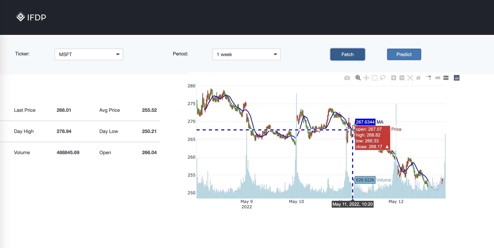

# Intelligent Financial Data Platform

# Data Description
Data stored in the Cosmos DB is following format in a dict with two important attributes id and val.

**id** : (Type -> string) key to store a price in format of "{Ticker Name}\_{Price}\_Time}" 

**val**: (Type -> float number) price value

```
Over here we the open price for ICE in 2022-03-23 is 134.9
{
    "id": "ICE_Open_2022-03-23-16:00:00", 
    "val": 134.9,
    "_rid": "wHkRAP3m3jMBAAAAAAAAAA==",
    "_self": "dbs/wHkRAA==/colls/wHkRAP3m3jM=/docs/wHkRAP3m3jMBAAAAAAAAAA==/",
    "_etag": "\"00003e00-0000-0100-0000-62453cca0000\"",
    "_attachments": "attachments/",
    "_ts": 1648704714
}
```

**Price:** There  are always five basic quantitative metrics for every ticker in a time period: Open, Close, High, Low and Volume.

Open and close are the prices at which a security began and ended trading in the same period. Volume is the total amount of trading activity. High and Low are the highest and lowest excuted price for the security.


# File Description
* app.py: frontend application that will do query on database and display the results on web.
* configure.py: configuration of the system.
* fetch.py: acutal fetching function implementation. Takes about 1 minute to update price of every ticker within S&P 500 stock pool.
* server.py: backend that will automatically fetch data from yahoo finance api and provoid data pipeline infrastructure for machine learning analysis and front end.
* s&p500.csv: all the stock ticker that is supported to fetch data now (S&P500). 

# Demo



